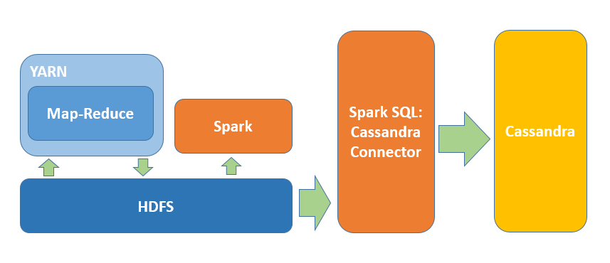

# Data Cleaning And exploration
## Aviation Dataset Mount & Initialization
To be able to work with data, first we have to mount the transportation dataset to our EC2 instance.
I used the `lsblk` command to see available block storages mounted to my EC2. Then created a separate folder and mounted the volume to the filesystem.
```bash
$ lsblk
$ sudo mkdir /data
$ mount /dev/xvdb /data
```
### References
* [AWS User Guide: Attaching EBS volumes](http://docs.aws.amazon.com/AWSEC2/latest/UserGuide/ebs-attaching-volume.html)
* [AWS User Guide: Using EBS volumes](http://docs.aws.amazon.com/AWSEC2/latest/UserGuide/ebs-using-volumes.html)

## Data exploration using `bash`
At a certain level bash is perfectly fine to discover what's included in the transportation dataset. At first with directory navigation we can investigate each folder and see what's inside.
Obviously we're just interested in the `aviation` subfolder.

```bash
$ ls
air_carrier_employees          air_carrier_statistics_summary  airline_origin_destination    aviation_safety_reporting
...
$ cd airline_ontime
$ ls
1988  1989  1990  1991  1992  1993  1994  1995  1996  1997  1998
...
$ cd 2008
$ ls
On_Time_On_Time_Performance_2008_10.zip  On_Time_On_Time_Performance_2008_2.zip  On_Time_On_Time_Performance_2008_6.zip
...
```
We can peek inside each zip file using `bash`as well, ff we pipe the output of each file to the `gunzip` command. Directing the output to an other file allows us to save samples and test our map-reduce jobs on small portion of data.
```bash
cat ./On_Time_On_Time_Performance_2008_10.zip | gunzip | head -255 > ~/airline_ontime_perf.csv
```
## Moving relevant data to Hadoop HDFS
We'll just work with the `airline_ontime` data, which contains on-time performance for each flight. A special `bash` script is getting all the zip archives in all subfolders, searches inside each zip file for CSV extensions and unzips only those files from the zip archive. We'll pipe each CSV output to a `hdfs` `put` command.
```bash
migration/move-ontime-perf-to-hadoop.sh /data/aviation /user/ec2-user/ontime_perf
```
### References
* [Migration scripts on GitHub](https://github.com/gitaroktato/cloud-capstone/blob/master/migration/move-ontime-perf-to-hadoop.sh)

# System Integration
All heavyweight data simplifying and transformation jobs are done by map-reduce over YARN. These jobs most of the time crawl all the CSV files under `airline_ontime` subfolder. The goal of these map-reduce jobs is to prepare dataset digestible for Spark. Spark provides the final results over this "clean" dataset.


## Cassandra Migration
Migrating to Apache Cassandra is done by using Spark Cassandra Connector. This allows shifting loaded DataFrames from Spark to Apache Cassandra.

### References
* [Spark Cassandra Connector](https://github.com/datastax/spark-cassandra-connector)
* [PySpark with Spark Cassandra Connector](https://github.com/datastax/spark-cassandra-connector/blob/master/doc/15_python.md)

# Solution Approach
## Question 1.1
_Rank the top 10 most popular airports by numbers of flights to/from the airport._

A map-reduce job collects all the from-to airport field from `airline_ontime` data and counts each airport. This is very similar to the well-known Word Count example in Hadoop documentation.

<..., line> -> **map()** -> <airport_id, 1> -> **reduce()** -> <airport_id, occurrence>

Map-Reduce execution is done by the following command.

```bash
bin/hadoop jar ~/IdeaProjects/cloud-capstone/out/artifacts/cloud_capstone/cloud-capstone.jar com.cloudcomputing.PopularAirportsPlaintext ontime_perf popular_airports
```

As result we get one file with airports in alphabetical order.
```
ABE	236094
ABI	39323
ABQ	1428081
...
```


This file is sorted and trimmed using `PySpark`
```
file = sc.textFile('hdfs://localhost:9000/user/ec2-user/popular_airports/part-r-00000')
rdd = file.cache()
rdd.map(lambda line: line.split()).filter(lambda tuple: len(tuple) == 2).filter(lambda tuple: len(tuple[0]) == 3).map(lambda tuple: (int(tuple[1]), tuple[0])).sortByKey(ascending=False).take(10)
```
### References
[Map-Reduce job](https://github.com/gitaroktato/cloud-capstone/blob/master/src/com/cloudcomputing/PopularAirportsPlaintext.java)


## Question 1.2
_Rank the top 10 airlines by on-time arrival performance._

The solution is similar to the previous. We get each carrier and it's arrival delay field. Then at the reduce phase we calculate the average arrival delay for each carrier.

<..., line> -> **map()** -> <carrier_id, arrival_delay> -> **reduce()** -> <carrier_id, average_arrival_delay>

Map-Reduce execution is done by the following command.

```bash
bin/hadoop jar ~/IdeaProjects/cloud-capstone/out/artifacts/cloud_capstone/cloud-capstone.jar com.cloudcomputing.AverageDelays ontime_perf avg_delays
```

As result we get one file with carriers in alphabetical order.
```
9E	5.87
AA	7.11
AL	8.29
...
```

This file is then sorted and trimmed using `PySpark`
```
file = sc.textFile('hdfs://localhost:9000/user/ec2-user/avg_delays/part-r-00000')
rdd = file.cache()
rdd = rdd.map(lambda line: line.split()).cache()
rdd2 = rdd.map(lambda tuple: (float(tuple[1]), tuple[0])).cache()
rdd2.takeOrdered(10)
```

### References
[Map-Reduce job](https://github.com/gitaroktato/cloud-capstone/blob/master/src/com/cloudcomputing/AverageDelays.java)
