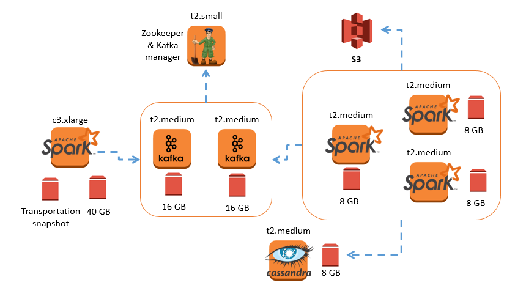
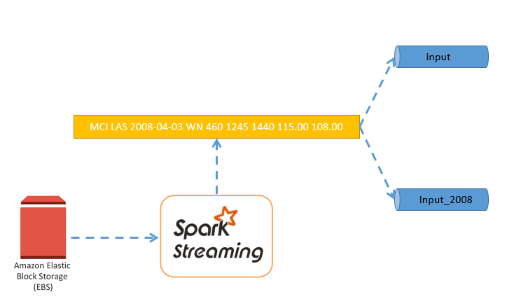
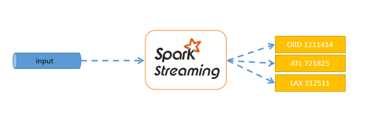
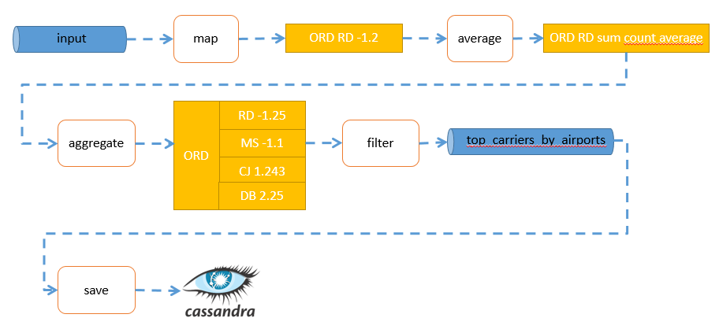
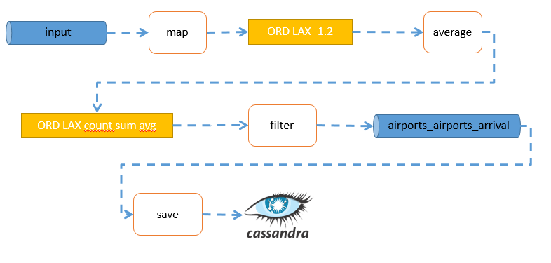

# System Integration

## Components and Data Flow
Input is being read from EBS volume using Spark Streaming. The results are trimmed and directed to
Kafka cluster. Separate Spark Steaming jobs are reusing this stream from Kafka, continuously refining
the data flow before saving it to Cassandra.


## Deployment View
Transportation dataset is mounted as EBS volume under a c3.xlarge instance. This also has a pretty big 40 GB local EBS volume for the extracted CSV files. These are ingested by local Spark Streaming job running in 4 threads parallel. Kafka cluster has 2 t2.medium nodes and coordinated by Zookeeper and kafka-manager. These are installed on a separate t2.small node. Spark Streaming cluster contains 1 director and 2 worker nodes. They're using an S3 bucket for saving checkpoints. For simplicity Cassandra is only installed to one t2.medium.



### Cassandra Migration
Migrating to Apache Cassandra is done by using Spark Cassandra Connector. This allows shifting loaded DataFrames from Spark to Apache Cassandra.

### References
* [Spark Cassandra Connector](https://github.com/datastax/spark-cassandra-connector)
* [kafka-manager](https://github.com/yahoo/kafka-manager)

# Solution Approach
## Feeding data into Kafka
 First we start a Spark job locally, that watches a directory for incoming files. That directory is populated with CSV files from the `airline_ontime` folder of transportation dataset. The CSV extraction is done by a `bash` script.

The Spark Streaming job will cut off all unnecessary columns from the on-time performance CSV files. The structure for one message is the following:

AIRPORT_FROM |
AIRPORT_TO |
DEPARTURE_DATE|
CARRIER_ID |
FLIGHT_NUM |
SCHEDULED_DEPARTURE_TIME |
DEPARTURE_TIME |
DEPARTURE_DELAY |
ARRIVAL_DELAY |

We're populating two input queues. One is just feeded with data from 2008.


Starting ingestion job locally on 4 threads.
```
~/spark-2.1.0-bin-hadoop2.7/bin/spark-submit --master local[4] --conf spark.streaming.backpressure.enabled=true --conf spark.streaming.receiver.maxRate=4000 ./ingest_files_to_kafka.py input
```

Populating the input folder
```
./move-ontime-perf-to-localfs.sh data/aviation input
```

Sample data in Kafka
```
MCI LAS 2008-04-03 WN 460 1245 1440 115.00 108.00
MCI LAS 2008-04-03 WN 1758 0900 0854 -6.00 -6.00
MCI LAS 2008-04-03 WN 2888 0705 0703 -2.00 -7.00
MCI LAX 2008-04-03 WN 238 1440 1553 73.00 57.00
MCI LAX 2008-04-03 WN 450 1135 1226 51.00 41.00
```

### References
* [Migration script on GitHub](https://github.com/gitaroktato/cloud-capstone/blob/master/migration/move-ontime-perf-to-localfs.sh)
* [Spark Streaming job on GitHub](https://github.com/gitaroktato/cloud-capstone/blob/master/python/ingest_files_to_kafka.py)

## Question 1.1


Airport from-to information is collected by using flatMap from input stream
```python
rows.flatMap(lambda row: [row[0], row[1]])
```
We use the `updateStateByKey` function with Spark checkpoints to count all the occurrences for all airports. The updateFunction is a simple counter function.
```python
airports.map(lambda airport: (airport, 1)).updateStateByKey(updateFunction)
```
To reduce the traffic, we cut off the amount of records to just the top 10 most popular in each partition.
```python
sorted.transform(lambda rdd: rdd.mapPartitions(cutOffTopTen))
```
```python
def cutOffTopTen(iterable):
	topTen = []
	for tupl in iterable:
		if len(topTen) < 10:
			topTen.append(tupl)
			topTen.sort(reverse=True)
		elif topTen[9][0] < tupl[0]:
			topTen[9] = tupl
			topTen.sort(reverse=True)
	return iter(topTen)
```
Then we sort RDDs by popularity.
```python
sorted = sorted.transform(lambda rdd: rdd.sortByKey(False))
```

### References
* [Spark Streaming job on GitHub](https://github.com/gitaroktato/cloud-capstone/blob/master/python/streaming_top_airports.py)

## Question 1.2
This is analogue to Question 1.1

### References
* [Spark Streaming job on GitHub](https://github.com/gitaroktato/cloud-capstone/blob/master/python/streaming_top_carriers.py)

## Question 2.1


First we use the `updateStateByKey` function with Spark checkpoints to count average departure delays for all airport-carrier pairs. The `updateFunction` calculates three values for each: sum, count and sum/count.
```python
airports_and_carriers.updateStateByKey(updateFunction)
```
```python
def updateFunction(newValues, runningAvg):
    if runningAvg is None:
        runningAvg = (0.0, 0, 0.0)
    # calculate sum, count and average.
    prod = sum(newValues, runningAvg[0])
    count = runningAvg[1] + len(newValues)
    avg = prod / float(count)
    return (prod, count, avg)
```

Then we use the `aggregateByKey` to have an ordered list of top ten performing carrier for each airport. This is tricky at first, but keeps calculations and data traffic at minimum. Aggregate contains top ten carriers and departure delays. Sample aggregated value for an airport: `[('TZ',-0.0001), ('AQ',0.025), ('MS',0.3)]`

```python
airports = airports.transform(lambda rdd: rdd.aggregateByKey([],append,combine))
```
```python
def append(aggr, newCarrierAvg):
	"""
	Add new element to aggregate. Aggregate contains top ten carriers and departure delays.
	Sample: [('TZ',-0.0001), ('AQ',0.025), ('MS',0.3)]
	"""
	aggr.append(newCarrierAvg)
	aggr.sort(key=lambda element: element[1])
	return aggr[0:10]
```
```python
def combine(left, right):
	"""
	Combine two aggregates. Aggregate contains top ten carriers and departure delays.
	Sample: [('TZ',-0.0001), ('AQ',0.025), ('MS',0.3)]
	"""
	for newElement in right:
		left.append(newElement)
	left.sort(key=lambda element: element[1])
	return left[0:10]
```

When this is done, all continuously refined top ten performing carriers are delivered to a separate topic called `top_carriers_by_airports` This topic is then consumed by another Spark Streaming job, which saves and updates values to Cassandra.


### References
* [Spark Streaming job on GitHub](https://github.com/gitaroktato/cloud-capstone/blob/master/python/streaming_top_carriers_by_airports.py)
* [Cassandra migration job on GitHub](https://github.com/gitaroktato/cloud-capstone/blob/master/python/streaming_top_carriers_by_airports_to_cassandra.py)
* [Cassandra table definitions](https://github.com/gitaroktato/cloud-capstone/blob/master/cassandra/streaming_ddl.cql)

# Question 2.2
This is analogue to Question 2.1

### References
* [Spark Streaming job on GitHub](https://github.com/gitaroktato/cloud-capstone/blob/master/python/streaming_top_airports_by_airports.py)
* [Cassandra migration job on GitHub](https://github.com/gitaroktato/cloud-capstone/blob/master/python/streaming_top_airports_by_airports_to_cassandra.py)
* [Cassandra table definitions](https://github.com/gitaroktato/cloud-capstone/blob/master/cassandra/streaming_ddl.cql)

# Question 2.4


We calculate the mean arrival delay for all the airport from-to pairs. The average calculation method is the same as in Question 2.1.

```python
airports_fromto = airports_fromto.updateStateByKey(updateFunction)
```

Then we just filter out for all relevant from-to pairs and save it to `airports_airports_arrival` topic in Kafka.
Another Spark Streaming job deals with updating results in Cassandra from this topic.

### References
* [Spark Streaming job on GitHub](https://github.com/gitaroktato/cloud-capstone/blob/master/python/streaming_airports_airports_arrival.py)
* [Cassandra migration job on GitHub](https://github.com/gitaroktato/cloud-capstone/blob/master/python/streaming_airports_airports_arrival_to_cassandra.py)
* [Cassandra table definitions](https://github.com/gitaroktato/cloud-capstone/blob/master/cassandra/streaming_ddl.cql)

# Question 3.1
Question 3.1 is not needed by description of . But if you're interested, check out solution in documentation of Task 1.
### References
* [Documentation of Task 1 in GitHub](https://github.com/gitaroktato/cloud-capstone/blob/master/documentation/README.md)
